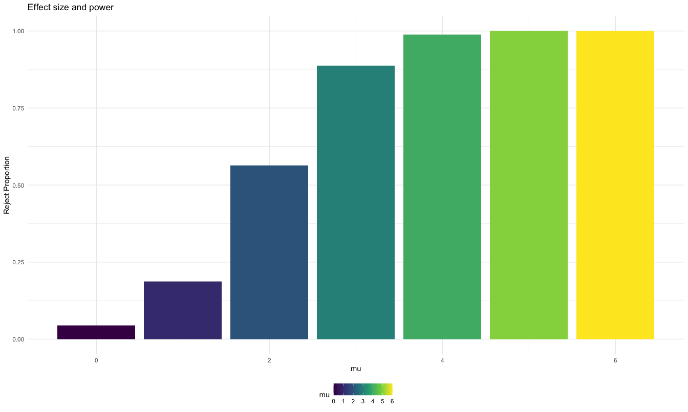
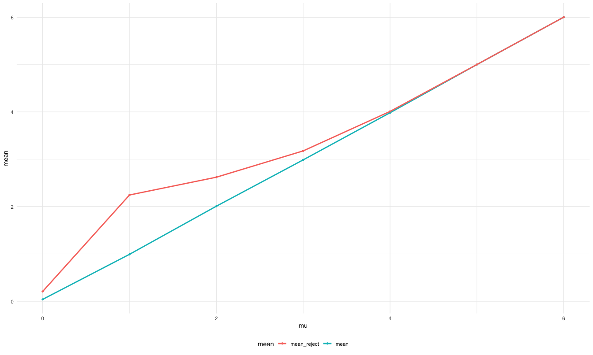

Homework 5
================
Hanyu Lu

## Problem 1

Read in the data.

``` r
homicide_df = 
  read_csv("homicide_data/homicide-data.csv") %>% 
  mutate(
    city_state = str_c(city, state, sep = "_"),
    resolved = case_when(
      disposition == "Closed without arrest" ~ "unsolved",
      disposition == "Open/No arrest"        ~ "unsolved",
      disposition == "Closed by arrest"      ~ "solved",
    )
  ) %>% 
  select(city_state, resolved) %>% 
  filter(city_state != "Tulsa_AL")
```

    ## Parsed with column specification:
    ## cols(
    ##   uid = col_character(),
    ##   reported_date = col_double(),
    ##   victim_last = col_character(),
    ##   victim_first = col_character(),
    ##   victim_race = col_character(),
    ##   victim_age = col_character(),
    ##   victim_sex = col_character(),
    ##   city = col_character(),
    ##   state = col_character(),
    ##   lat = col_double(),
    ##   lon = col_double(),
    ##   disposition = col_character()
    ## )

Let’s look at this a bit

``` r
aggregate_df = 
  homicide_df %>% 
  group_by(city_state) %>% 
  summarize(
    hom_total = n(),
    hom_unsolved = sum(resolved == "unsolved")
  )
```

    ## `summarise()` ungrouping output (override with `.groups` argument)

Can I do a prop test for a single city?

``` r
prop.test(
  aggregate_df %>% filter(city_state == "Baltimore_MD") %>% pull(hom_unsolved), 
  aggregate_df %>% filter(city_state == "Baltimore_MD") %>% pull(hom_total)) %>% 
  broom::tidy()
```

    ## # A tibble: 1 x 8
    ##   estimate statistic  p.value parameter conf.low conf.high method    alternative
    ##      <dbl>     <dbl>    <dbl>     <int>    <dbl>     <dbl> <chr>     <chr>      
    ## 1    0.646      239. 6.46e-54         1    0.628     0.663 1-sample… two.sided

Try to iterate ……..

``` r
results_df = 
  aggregate_df %>% 
  mutate(
    prop_tests = map2(.x = hom_unsolved, .y = hom_total, ~prop.test(x = .x, n = .y)),
    tidy_tests = map(.x = prop_tests, ~broom::tidy(.x))
  ) %>% 
  select(-prop_tests) %>% 
  unnest(tidy_tests) %>% 
  select(city_state, estimate, conf.low, conf.high)
```

``` r
results_df %>% 
  mutate(city_state = fct_reorder(city_state, estimate)) %>% 
  ggplot(aes(x = city_state, y = estimate)) +
  geom_point() + 
  geom_errorbar(aes(ymin = conf.low, ymax = conf.high)) + 
  theme(axis.text.x = element_text(angle = 90, vjust = 0.5, hjust = 1))
```


``` r
city_prop_test = function(df) {
  
  n_unsovled ...
  n_total ... 
  
  prop.test(.....)
  
}


homicide_df = 
  read_csv("data/homicide-data.csv") %>% 
  mutate(
    city_state = str_c(city, state, sep = "_"),
    resolved = case_when(
      disposition == "Closed without arrest" ~ "unsolved",
      disposition == "Open/No arrest"        ~ "unsolved",
      disposition == "Closed by arrest"      ~ "solved",
    )
  ) %>% 
  select(city_state, resolved) %>% 
  filter(city_state != "Tulsa_AL") %>% 
  nest(data = resolved)
```

    ## Error: <text>:3:14: unexpected symbol
    ## 2:   
    ## 3:   n_unsovled ...
    ##                 ^

## Problem 2

    ## List of 1
    ##  $ legend.position: chr "bottom"
    ##  - attr(*, "class")= chr [1:2] "theme" "gg"
    ##  - attr(*, "complete")= logi FALSE
    ##  - attr(*, "validate")= logi TRUE


In general, data collected from the experiment arm start to increase
over time, while data collected from the control arm are relatively
stable over time.

# Problem 3

``` r
sample = function(mu){
  samp_data = tibble(
    samp = rnorm(30, mu, 5)
  )
  samp_result = nest(samp_data, data = everything()) %>%
  mutate(
    t_test = map(.x = data, ~t.test(x = .x,mu=0,sd=5, alternative = 'two.sided', paired = FALSE, conf.level = 0.95)),
    t_test = map(t_test, broom::tidy)
) %>% 
  unnest(t_test) %>% 
  select(data, estimate, statistic, p.value) %>% 
  mutate(
    mu = mu,
    decision = p.value <= 0.05
  )
  return(samp_result)
}


set.seed(996)


output = vector("list", 7)

for (i in 0:6) {
  output[[i+1]] = rerun(5000, sample(i)) 
}

samp_results = bind_rows(output)
```

    ## `summarise()` ungrouping output (override with `.groups` argument)



As the difference between true mean and mean of the null hypothesis
increases, the probability that a false null hypothesis is rejected
increases. In other words, as the effect size increases, power also
increase.

    ## `summarise()` ungrouping output (override with `.groups` argument)
    ## `summarise()` ungrouping output (override with `.groups` argument)



The sample average of μ̂ across tests for which the null is rejected is
approximately equal to the true value of μ for μ = 0, 4, 5, 6, but is
different from μ for μ = 1, 2, 3. The reason is that samples not
rejected for μ = 1, 2, 3 account for a larger proportion of total
samples. Consequently, as true means get closer to the hypothetical
mean, means of samples rejected are more likely to deviate from the true
mean, which result in a large difference for the points of μ = 1, 2. On
the other hand, since the proportion of samples rejected for μ = 4, 5, 6
is close to 1, their means of estimates are close to their true mean.
The proportion of samples rejected for μ = 0 is about 0.05, the mean
estimates are errors that follow a normal distribution with mean 0.
